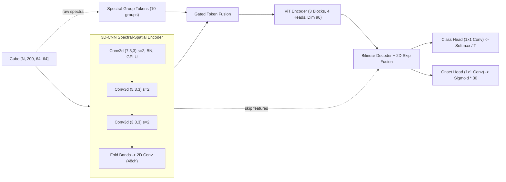

# Model Card: TerraSpectraNet (v1.0.0-Hybrid)

## Model Details
- **Model Name:** TerraSpectraNet
- **Architecture:** Hybrid 3D-CNN Spectral-Spatial Encoder + Vision Transformer (ViT)
- **Model Version:** 1.0.0
- **Total Parameters:** 743,109 (FP32)
- **Artifact Format:** TorchScript (`models/model.pt`, 3.02 MB)
- **Primary Framework:** PyTorch & PyTorch Lightning
- **License:** MIT / Apache-2.0 compatible

---

## Intended Use
- **Primary Task:** Early, pre-visual detection and spatial forecasting of fungal crop blight (e.g. *Phytophthora infestans*, *Septoria tritici*) from spaceborne and airborne hyperspectral imagery.
- **Contract Adherence:**
  - **Contract C1 Input:** Normalized surface reflectance `float32[N, 200, 64, 64]`, resampled to the canonical 200-band grid (400–2500 nm). Nodata pixels masked to 0.0.
  - **Contract C2 Output:** Dual-head output tuple `(probs, onset)`:
    - `probs`: `float32[N, 4, 64, 64]` softmax probability distribution over 4 disease stages:
      - `0`: Healthy Canopy
      - `1`: Early Pre-Visual Stress (7 to 25 days before visible symptoms)
      - `2`: High Blight Risk (1 to 7 days before visible symptoms)
      - `3`: Visible Disease (0 days, necrotic lesion)
    - `onset`: `float32[N, 1, 64, 64]` estimated continuous lead time until symptom emergence $[0.0, 30.0]$ days.
  - **Contract C4 Explainability:** Integrated Gradients band attributions map to dominant indicators (`red_edge_shift`, `pri_decline`, `chlorophyll_loss`, `water_stress`) for zone polygon properties.

---

## Architectural Design



### Why the Hybrid Architecture?
As established in the Day 9 ablation study ([`model/reports/ablations.md`](file:///c:/Users/Acer-Nitro/Desktop/Infotact/terrasectra/b21m3g4-TerraSpectra/model/reports/ablations.md)):
1. **3D Convolutions:** Act as continuous spectral derivative operators across contiguous wavelengths (resolving 700–740 nm red-edge inflection and 531/570 nm PRI variations). Replacing 3D-CNN with a $1\times1$ projection collapsed Macro F1 from 0.519 to 0.247.
2. **Vision Transformer:** Learns spatial contextual attention across canopy patches, distinguishing clustered disease foci from background variability. Removing ViT collapsed Overall Accuracy to 63.9%.

---

## Performance & Evaluation

### Comparative Architecture Ablations (Day 9)
| Architecture Variant | Parameters | Train Loss | Val Loss | Overall Accuracy (OA) | Macro F1 | Mean IoU |
|---|---|---|---|---|---|---|
| **Hybrid (3D-CNN + ViT)** | **743 K** | **1.979** | **2.011** | **95.9%** | **0.519** | **0.455** |
| ViT Only | 692 K | 2.431 | 2.176 | 94.6% | 0.247 | 0.238 |
| 3D-CNN Only | 422 K | 2.528 | 2.912 | 63.9% | 0.234 | 0.180 |

### Probability Calibration
Temperature scaling fitted on validation set: $T = 0.129$, minimizing Expected Calibration Error (ECE) for operational risk thresholds.

---

## Explainability (XAI)
The model incorporates Integrated Gradients spectral attribution (`terraspectra_model.explain`), scoring relative band sensitivity against baseline healthy spectra:
- **Red-Edge Blue Shift ($690-760\,\text{nm}$):** Flags early breakdown of mesophyll cell structure.
- **Photochemical Reflectance Index ($520-580\,\text{nm}$):** Detects xanthophyll cycle pigment shifts prior to chlorophyll loss.
- **Short-Wave Infrared Water Absorption ($1450, 1940\,\text{nm}$):** Flags foliar dehydration.

CLI inspection tool:
```bash
python -m terraspectra_model.cli explain --input data/synth/val.npz --steps 16
```

---

## Limitations & Agronomic Guidance
1. **Simulator Ground Truth:** Public remote sensing benchmarks lack field-verified "21 days before symptom" labels. Training labels are generated from biophysical PROSAIL canopy decay equations. Forecasts serve as risk ranking scores, not certified laboratory agronomic guarantees.
2. **Vegetation Masking:** The model is optimized for vegetated pixels (NDVI $> 0.35$). Bare soil, roads, and water bodies must be masked out prior to zone polygon generation using the pipeline indices.
3. **Sensor Generalization:** Calibrated for 200-band resampled cubes (EnMAP, PRISMA, EO-1 Hyperion). Multimodal Sentinel-2 inputs are supported only when spectrally upsampled.
