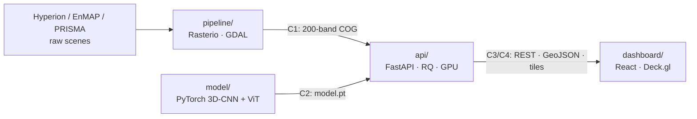

# TerraSpectra

**Hyperspectral crop-disease forecasting.** TerraSpectra ingests hyperspectral satellite cubes (200+ bands), runs a 3D-CNN + Vision Transformer model to spot pre-visual chlorophyll and water stress, and highlights at-risk zones on a 3D map. The aim is to flag, for example, a fungal blight outbreak weeks before leaves change colour.



## Repository layout

| Folder | Owner | What | Docs |
|---|---|---|---|
| [contracts/](contracts/) | everyone | Frozen Day-1 interfaces: cube spec, model I/O, OpenAPI, zones schema, fixtures | [README](contracts/README.md) |
| [pipeline/](pipeline/) | P1 | Ingest and normalise hyperspectral scenes into C1 cubes | [README](pipeline/README.md) |
| [model/](model/) | P2 | 3D-CNN + ViT hybrid: training, evaluation, export | [README](model/README.md) |
| [api/](api/) | P3 | Chunked GPU inference, zone extraction, map tiles | [README](api/README.md) |
| [dashboard/](dashboard/) | P4 | 3D GIS dashboard | [README](dashboard/README.md) |
| [models/](models/) | P2/P3 | Served `model.pt` (git-ignored) | [README](models/README.md) |

The 15-day team plan is in [PROJECT_PLAN.md](PROJECT_PLAN.md).

## Prerequisites
- Python 3.11+ and [uv](https://docs.astral.sh/uv/)
- Node 22+ and pnpm
- Docker with Compose v2 (optional: NVIDIA Container Toolkit for the GPU worker)

## Quick start

```bash
make setup          # install all modules, create .env from .env.example
make test           # run every module's test suite
make stub-model     # models/model.pt = contract stub (until P2 ships a trained model)
make sample-cube    # data/synthetic_cube.tif (C1-valid)
make up             # postgres, redis, api :8000, worker, dashboard :8080
# or: make up-gpu
```

Each module also runs on its own. For example, the dashboard runs entirely against mocks:

```bash
cd dashboard && pnpm dev        # VITE_USE_MOCKS=true by default in development
```

The API runs without Redis or Postgres:

```bash
cd api && TS_ENV=development TS_QUEUE_MODE=inline uv run terraspectra-api
```

## Working agreement
- Each person owns exactly one folder. `contracts/` changes need all four approvals (see [CODEOWNERS](.github/CODEOWNERS)).
- CI ([.github/workflows/ci.yml](.github/workflows/ci.yml)) runs lint, type checks and tests only for the folders that changed.
- Never commit rasters, weights or secrets. `.gitignore` and pre-commit enforce this.

See [CONTRIBUTING.md](CONTRIBUTING.md).

## Scientific caveat
No public dataset provides ground-truth labels of the form "disease N days before visible symptoms". The model is trained on physics-based simulated stress plus proxy labels from pre-visual spectral indices. Treat `days_to_onset` as an indicative estimate until it has been calibrated against field observations.
