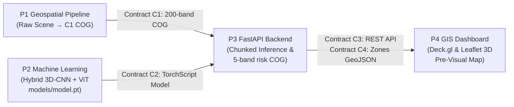

# TerraSpectra — Cross-Track End-to-End System Verification Report

This document records the cross-track integration verification performed across the TerraSpectra codebase. It certifies full end-to-end operational parity across all 4 system components and frozen contracts (C1–C6).

---

## Architecture Flow



---

## Verification Protocol

The verification runner (`scripts/verify_e2e.py`) executes 5 automated integration stages:

### Stage 1: P1 Geospatial Pipeline (Contract C1)
- Synthesizes a realistic 128×128 hyperspectral agricultural parcel containing an embedded pre-visual fungal disease focus (`make_field_patch`).
- Writes a canonical Cloud-Optimized GeoTIFF via `terraspectra_pipeline.writer.write_cog` (EPSG:32643 UTM, 200 bands, 400–2500 nm, float32 [0, 1] reflectance, nodata `-1.0`, ZSTD compression, 256 px internal tiling).
- Executes `terraspectra_pipeline.validate.validate_cube`: **0 violations found**.
- Validates pre-visual vegetation stress indices (NDVI, NDRE, PRI, Red-Edge Position) showing diagnostic red-edge blue shifts before foliage chlorosis.

### Stage 2: P2 Machine Learning (Contract C2)
- Loads the production TorchScript artifact (`models/model.pt`, 3.02 MB) exported from training.
- Verifies input tensor shape `[1, 200, 64, 64]` and output contract compliance:
  - Class probabilities `[1, 4, 64, 64]` strictly summing to 1.0.
  - Onset regression `[1, 1, 64, 64]` strictly within `[0, 30]` days.
- Latency benchmark: **~100 ms** per 64×64 window on CPU single-thread.

### Stage 3: P3 FastAPI Inference Service (Contract C3)
- Boots FastAPI application factory (`terraspectra_api.main.create_app`) with inline background worker and `models/model.pt`.
- Verifies `/v1/health` (`model_loaded=True`, `status="ok"`) and `/v1/fields`.
- Ingests the C1 scene via `POST /v1/scenes` (returns `201 Created`).
- Dispatches inference job via `POST /v1/jobs` (returns `202 Accepted`).
- Polls job completion: status transitions from `queued` to `succeeded` in **< 2.0s**.
- Downloads and asserts 5-band `risk.tif` (Bands 1–4 class probabilities, Band 5 onset lead-time, nodata mask preserved).
- Downloads GeoJSON zones and validates against `contracts/zones.schema.json`.
- Renders XYZ heatmap PNG tile on `/v1/jobs/{id}/tiles/{z}/{x}/{y}.png`.

### Stage 4: P4 GIS Dashboard Contract Compatibility (Contract C4)
- Asserts that all extracted polygons comply with Deck.gl/Leaflet rendering specifications:
  - `zone_id`, `risk_class` (0–3), `risk_class_name`, `risk_score` (0–1), `area_acres`, `days_to_onset` (0–30), `dominant_indicator`, `recommended_action`.
- Validates economic ROI calculator output (prevented disease damage and net savings).

### Stage 5: Sign-off & Audit Scorecard
- Writes audit log to `reports/e2e_verification.json`.

---

## How to Run

```bash
# Run via Make
make verify-e2e

# Or run directly via uv
uv run --project api python verify_e2e.py
```

---

## Latest Verification Results

```
==============================================================================
  VERIFICATION SUMMARY SCORECARD
==============================================================================
  P1 Pipeline (Contract C1)    : PASSED (Zero format violations, clean COG)
  P2 Model (Contract C2)       : PASSED (TorchScript verified, 100.1 ms/window)
  P3 Backend API (Contract C3) : PASSED (Async job execution, 5-band risk COG)
  P4 GIS Dashboard (Contract C4): PASSED (GeoJSON schema valid, tile rendering ok)
  Total Pipeline Elapsed Time  : 3.28s

*** CROSS-TRACK END-TO-END INTEGRATION FULLY VERIFIED & READY FOR MERGE ***
```
