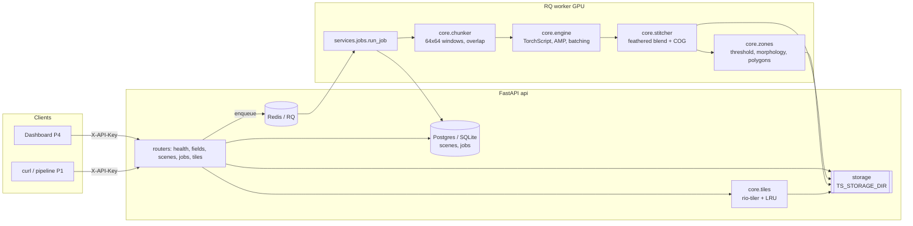

# TerraSpectra Inference API (`api/`, owner P3)

FastAPI service that turns a hyperspectral cube (contract **C1**: 200 bands, float32 COG) into
crop-disease forecasts: a 5-band risk raster, GeoJSON risk zones (contract **C4**) and XYZ heatmap
tiles. It chunks huge rasters into 64x64 windows, batches them through a TorchScript model
(contract **C2**) on GPU (CPU fallback), blends overlapping windows and vectorises the result.

The HTTP surface is frozen in [`contracts/openapi.yaml`](../contracts/openapi.yaml) (contract
**C3**); a test asserts the app's routes and `operationId`s match it exactly.

---

## Architecture



Job pipeline: `scene -> (optional AOI clip) -> chunk -> infer -> stitch -> risk.tif (COG) ->
zones.geojson -> summary`, with `progress` written to the job row along the way.

## Setup

```bash
cd api
uv sync --all-extras          # installs terraspectra-contracts from ../contracts/python
uv run ruff check . && uv run ruff format --check . && uv run mypy && uv run pytest -q
```

Requires Python >= 3.11 and [uv](https://docs.astral.sh/uv/). Tests need no Redis, Postgres,
network or GPU.

### Run locally without Redis (inline mode)

```bash
make -C .. stub-model                     # ../models/model.pt (or let the API export a stub)
export TS_QUEUE_MODE=inline TS_ENV=development
export TS_STORAGE_DIR=./data TS_MODEL_PATH=../models/model.pt
uv run terraspectra-api                   # http://127.0.0.1:8000/docs
```

In `inline` mode `POST /v1/jobs` still returns `202` immediately and the job runs in-process as a
background task, so a single container is enough for demos. With `TS_QUEUE_MODE=rq` (the default)
jobs go to Redis and are executed by `python -m terraspectra_api.worker`.

### Run the whole stack

```bash
docker compose up --build                                            # CPU
docker compose -f docker-compose.yml -f docker-compose.gpu.yml up    # GPU worker
```

`api/Dockerfile` builds from the **repository root** (it needs `contracts/python`). The entrypoint
dispatches `api` (alembic upgrade + uvicorn on :8000), `worker` (RQ `SimpleWorker`, model loaded
once per process), `migrate`, or any other command verbatim.

## Environment variables

All settings use the `TS_` prefix (`api/src/terraspectra_api/settings.py`).

| Variable | Default | Meaning |
|---|---|---|
| `TS_ENV` | `development` | `development`/`test` auto-create tables and fall back to the contract stub model; `production` fails fast without a model and rejects the default API key |
| `TS_API_KEYS` | `dev-key-change-me` | Comma-separated keys accepted in `X-API-Key` |
| `TS_DATABASE_URL` | `sqlite:///./terraspectra.db` | SQLAlchemy URL (`postgresql+psycopg://...` in compose) |
| `TS_REDIS_URL` | `redis://localhost:6379/0` | RQ broker |
| `TS_STORAGE_DIR` | `./data` | Artifacts: `scenes/`, `jobs/<job_id>/{risk.tif,zones.geojson}`, `cache/` |
| `TS_MODEL_PATH` | `./models/model.pt` | TorchScript model (contract C2) |
| `TS_DEVICE` | `auto` | `auto` picks CUDA when available, else `cpu`; `cuda` fails if absent |
| `TS_BATCH_SIZE` | `32` | Windows per forward pass |
| `TS_WINDOW_OVERLAP` | `16` | Overlap in pixels between 64x64 windows (feathered blend) |
| `TS_CORS_ORIGINS` | *(empty)* | Comma-separated allowed origins for the dashboard |
| `TS_LOG_LEVEL` | `INFO` | Root log level (JSON logs on stdout) |
| `TS_QUEUE_MODE` | `rq` | `rq` (Redis worker) or `inline` (in-process, for dev/tests) |
| `TS_QUEUE_NAME` | `terraspectra` | RQ queue name |
| `TS_JOB_TIMEOUT_S` | `3600` | RQ job timeout |
| `TS_FIELDS_PATH` | packaged `data/fields.geojson` | Field boundaries served by `/v1/fields` |
| `TS_MAX_UPLOAD_MB` | `4096` | Upload limit for `POST /v1/scenes` (`413` beyond it) |
| `TS_RATE_LIMIT` | `120/minute` | Per-API-key limit on authenticated routes (`0/minute` disables) |
| `TS_URI_ALLOWED_ROOTS` | `TS_STORAGE_DIR` | Directories that `file://` scene URIs may point into |
| `TS_HOST` / `TS_PORT` | `127.0.0.1` / `8000` | Bind address for `terraspectra-api` |
| `TS_ZONE_MIN_PROB` | `0.4` | Minimum class probability for a pixel to join a zone |
| `TS_ZONE_MIN_ACRES` | `1.0` | Minimum zone size after morphological cleanup |
| `TS_ZONE_SIMPLIFY_PX` | `0.5` | Polygon simplification tolerance, in pixels |
| `TS_TILE_CACHE_SIZE` | `1024` | LRU-cached rendered tiles per process |
| `TS_PREFETCH_BATCHES` | `2` | Raster-read prefetch depth (overlaps I/O with compute) |

## Curl walkthrough

```bash
KEY=dev-key-change-me
BASE=http://localhost:8000/v1

# 0. a synthetic C1 cube to play with
make -C .. sample-cube            # ../data/synthetic_cube.tif

# 1. health (public, no key)
curl -s $BASE/health
# {"status":"ok","version":"1.0.0","device":"cpu","model_loaded":true}

# 2. register a scene (multipart upload; or -F uri=file:///data/cube.tif)
SCENE=$(curl -s -H "X-API-Key: $KEY" -F file=@../data/synthetic_cube.tif -F name=demo \
        $BASE/scenes | tee /dev/stderr | jq -r .scene_id)

# 3. create a job (optionally "field_id" or a GeoJSON "aoi" polygon in EPSG:4326)
JOB=$(curl -s -H "X-API-Key: $KEY" -H 'Content-Type: application/json' \
      -d "{\"scene_id\":\"$SCENE\"}" $BASE/jobs | jq -r .job_id)

# 4. poll
until [ "$(curl -s -H "X-API-Key: $KEY" $BASE/jobs/$JOB | jq -r .status)" != "running" ]; do sleep 2; done
curl -s -H "X-API-Key: $KEY" $BASE/jobs/$JOB | jq '{status, progress, summary}'

# 5. artifacts
curl -s  -H "X-API-Key: $KEY" $BASE/jobs/$JOB/zones | jq '.features[0].properties'
curl -sO -H "X-API-Key: $KEY" $BASE/jobs/$JOB/risk.tif      # 5-band float32 COG
curl -s  $BASE/jobs/$JOB/tiles/12/2925/1789.png -o tile.png # public XYZ tiles
```

Outputs: `risk.tif` bands 1-4 are the class probabilities (`healthy`, `early_stress`,
`high_blight_risk`, `visible_disease`), band 5 is `days_to_onset`, nodata `-1`, same CRS/transform
as the input cube. `zones.geojson` validates against `contracts/zones.schema.json`.
Errors are always `{"detail": "...", "code": "..."}`; every response carries `X-Request-ID`.

## Performance notes

- **Memory is bounded by design.** The chunker reads one `64 x (batch_size * stride)` strip at a
  time, so peak read memory is about `2 * batch_size * 200 * 64 * 64 * 4 B` (~100 MB at
  `TS_BATCH_SIZE=32`), independent of scene size. Stitcher accumulators are `(5, H, W)` float32 and
  spill to a memmap above ~64 M pixels.
- **I/O usually dominates on CPU.** A 256x256 synthetic scene spends ~95 % of its time in rasterio
  reads with the stub model; batching only pays off on GPU. `TS_PREFETCH_BATCHES` overlaps reads
  with inference in a background thread.
- **GPU path**: pinned host buffers, `non_blocking` copies, `torch.inference_mode`, FP16 autocast on
  CUDA, `cudnn.benchmark`. The worker uses RQ's `SimpleWorker` (no fork per job) so the model and
  CUDA context are created once per process.
- **Overlap costs compute**: `TS_WINDOW_OVERLAP=16` means each pixel is inferred ~1.8x on average;
  drop it to 8 for throughput, raise it for smoother seams.
- **Tiles** come from the COG's internal overviews via rio-tiler, LRU-cached per process and served
  with `Cache-Control: public, max-age=86400, immutable` (job artifacts never change).
- Not yet benchmarked on a real 5 GB cube or a real GPU — that is Day 10, see below.

## Day 1-15 checklist (P3 in `PROJECT_PLAN.md`)

- [x] **Day 1** Contracts frozen; service built against `synthetic_cube.py` + `stub_model.py`.
- [x] **Day 2** FastAPI skeleton: settings, JSON logging + request ids, `/v1/health`, Dockerfile,
      compose wiring, `/metrics`.
- [x] **Day 3** Scene registry: multipart upload or `file://` URI, C1 validation, EPSG:4326 bounds,
      SQLAlchemy + Alembic. *(TODO: S3/MinIO backend in `storage.py`.)*
- [x] **Day 4** Job lifecycle: `POST/GET /v1/jobs`, RQ on Redis or inline mode, progress reporting.
- [x] **Day 5** `core/chunker.py`: overlapping 64x64 windows covering every pixel, bounded memory,
      nodata/AOI masking, threaded prefetch.
- [x] **Day 6** `core/engine.py`: TorchScript load, device auto-select, dynamic batching, pinned
      memory, AMP, C2 shape validation, stub fallback in dev/test. *(TODO: CUDA streams, multi-GPU.)*
- [x] **Day 7** `core/stitcher.py`: feathered blending + 5-band risk COG.
- [x] **Day 8** `core/zones.py`: threshold -> opening -> components -> polygons, acres, mean risk and
      onset, `dominant_indicator` heuristic, `recommended_action` rules, C4 output.
- [x] **Day 9** `core/tiles.py`: 256x256 RGBA XYZ tiles, green->red colormap, transparent outside
      data, LRU cache + cache headers.
- [ ] **Day 10** Benchmark a 5 GB cube, tune batch size, multiprocess reads, report km2/min.
- [x] **Day 11** `/v1/fields`, CORS, API-key auth, rate limiting, request validation, error model.
- [x] **Day 12** pytest + httpx suite: auth, contract test vs `openapi.yaml`, end-to-end job,
      chunker/stitcher/zones units. *(TODO: schemathesis fuzzing and a locust load report.)*
- [ ] **Day 13** Swap the stub for P2's `model.pt` and run on P1's real COGs.
- [ ] **Day 14** Serve P4's dashboard against the live API (CORS, tile latency).
- [ ] **Day 15** Deployment rehearsal and demo script.

## Layout

```
api/
├── alembic/                  # migrations (0001_initial: scenes, jobs)
├── docker-entrypoint.sh      # api | worker | migrate | <cmd>
├── Dockerfile                # build from the repo root
├── src/terraspectra_api/
│   ├── core/                 # chunker, engine, stitcher, zones, tiles
│   ├── routers/              # health, fields, scenes, jobs, tiles
│   ├── services/             # jobs (pipeline), queue (rq/inline), fields
│   ├── data/fields.geojson   # packaged default for /v1/fields
│   ├── main.py               # create_app factory, middleware, lifespan
│   └── worker.py             # RQ worker entry point
└── tests/                    # auth, contract, end-to-end, unit
```
