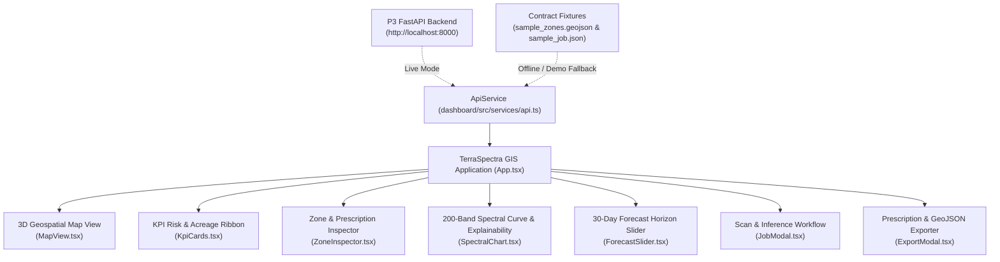

# dashboard/ — GIS 3D Analyst Dashboard (P4)

Interactive 3D geospatial dashboard for **TerraSpectra: Hyperspectral Pre-Visual Crop Disease Forecasting**.

Visualizes pre-visual crop stress (e.g., fungal blight up to 3 weeks before symptoms appear on foliage) by integrating the outputs of:
- **P1 Geospatial Pipeline**: Contract C1 canonical 200-band hyperspectral cubes.
- **P2 Machine Learning**: Contract C2 3D-CNN + Vision Transformer hybrid model (`models/model.pt`), per-pixel risk classes (0–3), onset regression (0–30 days), and Integrated Gradients spectral attribution.
- **P3 FastAPI Backend**: Contract C3 REST API endpoints (`/v1/scenes`, `/v1/jobs`, `/v1/jobs/{id}/zones`, `/v1/jobs/{id}/tiles`, `/v1/fields`).

---

## Architecture & Features



### Key Capabilities
1. **Interactive 2D/3D Geospatial Map (`MapView.tsx`)**:
   - Field perimeter boundary (Contract C3 field boundary).
   - Extruded 3D Contract C4 risk zones with class color mapping:
     - `0: Healthy Canopy` (#10B981)
     - `1: Pre-Visual Early Stress` (#F59E0B)
     - `2: High Blight Risk` (#F97316)
     - `3: Visible Disease Outbreak` (#EF4444)
   - Risk heatmap overlay layer with real-time opacity slider.
   - Satellite imagery, Dark grid, and Terrain 3D basemap switchers.
   - Interactive hover tooltips and click-to-inspect zone selection.

2. **Agronomic Prescription & Explainability (`ZoneInspector.tsx`)**:
   - Onset lead-time countdown (days until visible symptoms).
   - Integrated Gradients spectral attribution (`red_edge_shift`, `pri_decline`, `chlorophyll_loss`, `water_stress`).
   - Actionable precision treatment recommendations (variable-rate spray prescription, bio-fungicides).

3. **200-Band Spectral Profile (`SpectralChart.tsx`)**:
   - Interactive comparison of healthy vs stressed canopy reflectance (400 nm – 2500 nm).
   - Diagnostic band callouts at 537 nm (PRI), 705 nm (red-edge blue shift), and 970 nm (water absorption).

4. **30-Day Forecast Horizon Slider (`ForecastSlider.tsx`)**:
   - Animated slider advancing from Day 30 (pre-visual infection) to Day 0 (visible symptoms).
   - Real-time zone filtering on the map.

5. **Dual Mode (Live API & Standalone Demo)**:
   - Connects live to `http://localhost:8000` via Vite reverse-proxy `/v1`.
   - Automatically falls back to offline contract fixtures (`contracts/fixtures/`) if backend is not running, ensuring guaranteed zero-downtime evaluation.

---

## Quickstart

### Prerequisites
- Node.js >= 18 (Tested on v24.2.0)
- npm >= 9

### Installation & Run

```bash
cd dashboard
npm install
npm run dev
```

Open [http://localhost:3000](http://localhost:3000) in your browser.

### Production Build

```bash
npm run build
npm run preview
```
