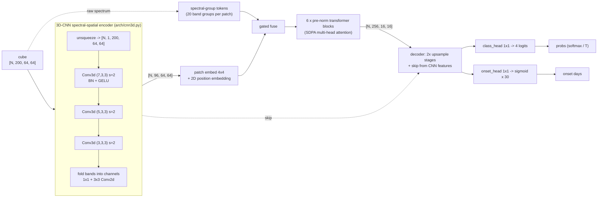

# model/ — 3D-CNN + ViT hybrid (P2)

Pre-visual crop-disease risk from 200-band hyperspectral windows. Produces the **contract C2**
artifact that `api/` serves: a TorchScript `model.pt` with

```
forward(x: float32[N, 200, 64, 64]) -> (probs: float32[N, 4, 64, 64], onset: float32[N, 1, 64, 64])
```

`probs` is a per-pixel softmax over `0 healthy`, `1 early_stress`, `2 high_blight_risk`,
`3 visible_disease`; `onset` is days-to-visible-symptoms in `[0, 30]`. Batch size is dynamic and
the model runs on CPU and CUDA.

## Honest note on labels

**No public dataset carries "fungal blight, three weeks before symptoms" ground truth.** This
module does not pretend otherwise. Training targets come from two synthetic-but-principled
sources, and the model card must say so:

1. **Simulated stress progression** (`synth/stress.py`). A simplified leaf + canopy reflectance
   model (optionally real PROSAIL via the `sim` extra) degrades chlorophyll `Cab`, equivalent water
   thickness `Cw`, leaf area index and pigment parameters along a 0–30 day timeline, reproducing
   the documented pre-visual signatures: red-edge blue-shift, rising green peak, PRI decline and
   changing SWIR water bands. Infected foci are blended into healthy fields and into the
   vegetation pixels of real benchmark scenes, so texture and sensor noise stay realistic.
2. **Proxy labels from pre-visual indices** (`synth/proxy_labels.py`) for unlabelled real scenes:
   REP shift, NDRE, PRI and CCI deficits against a per-field baseline, weighted-voted into classes.

Consequences to keep in mind:

- `days_to_onset` is a **demo-level estimate calibrated against the simulator**, not a validated
  agronomic forecast. Treat it as a ranking signal ("this zone is further along than that one").
- Class boundaries come from rules (see below), so metrics measure agreement with the simulator,
  not with field-verified disease.
- Real-scene validation on P1's cubes (Day 13–14) is what turns this from a demo into evidence.

Label rules for an infected pixel `d` days before visible symptoms (configurable):

| condition | class |
|---|---|
| not infected, or `d > max_infected_days` (25) | `0 healthy` (onset target 30) |
| `7 < d <= 25` | `1 early_stress` |
| `0 < d <= 7` | `2 high_blight_risk` |
| `d == 0` | `3 visible_disease` |

## Setup

```bash
cd model
uv sync --all-extras          # or: uv sync           (core only)
uv run pytest -q
uv run ruff check . && uv run ruff format --check . && uv run mypy
```

Optional extras, all imported lazily so the code works without them: `onnx` (ONNX export +
onnxruntime parity), `tracking` (MLflow logger), `sim` (real PROSAIL backend).

## Architecture



`forward_logits` is used for training; `forward` applies the (optionally calibrated) softmax and
is what gets traced for export. `model.variant` selects the Day-9 ablations: `hybrid` (default),
`cnn_only`, `vit_only`.

Module map:

| path | contents |
|---|---|
| `config.py`, `configs/*.yaml` | pydantic config models, `load_config(path, overrides)` |
| `indices.py` | NDVI, NDRE, PRI, CCI, NDWI, red-edge position on the canonical grid |
| `data/spectral.py` | sensor → canonical 200-band resampling (linear or FWHM Gaussian SRF) |
| `data/benchmarks.py` | Indian Pines / Salinas / Pavia U `.mat` loaders + vegetation masks |
| `data/windows.py` | window datasets, augmentation, `TerraSpectraDataModule` |
| `synth/stress.py` | reflectance model, progression rules, field-patch synthesis, blending |
| `synth/proxy_labels.py` | index-based proxy classes + confidence |
| `arch/` | `cnn3d.py`, `vit.py`, `hybrid.py` (`TerraSpectraNet`) |
| `losses.py`, `lightning_module.py`, `train.py` | focal + masked Huber, metrics, trainer |
| `evaluate.py` | JSON metrics report, lead-time curve, temperature scaling, ECE |
| `explain.py` | integrated gradients → band importance → C4 `dominant_indicator` |
| `export.py` | TorchScript / FP16 / ONNX export, `verify_parity`, `benchmark` |

## CLI

```bash
# Train (synthetic source needs no downloads); override any config key with -s a.b=value
uv run terraspectra-model train -c configs/default.yaml -s train.max_epochs=30
uv run terraspectra-model train -c configs/tiny.yaml -s train.fast_dev_run=true   # smoke test

# Dump a synthetic dataset, then train from it (faster than on-the-fly synthesis)
uv run terraspectra-model synth --n 2000 --output data/synth/train.npz
uv run terraspectra-model train -c configs/default.yaml \
    -s data.source=npz -s 'data.npz_paths=[data/synth/train.npz]'

# Metrics report (OA, macro F1, mIoU, per-class F1, onset MAE, lead-time curve) + calibration
uv run terraspectra-model evaluate -c configs/default.yaml \
    --checkpoint runs/default/checkpoints/last.ckpt --output reports/metrics.json --calibrate

# Export the C2 artifact to the repo-root models/ dir the API serves, verifying eager parity
uv run terraspectra-model export -c configs/default.yaml \
    --checkpoint runs/default/checkpoints/last.ckpt --output ../models/model.pt --fp16 --onnx

# Throughput (windows/sec)
uv run terraspectra-model benchmark --model ../models/model.pt --batch-size 32
```

Training in Docker (build context is the **repo root**):

```bash
docker build -f model/Dockerfile -t terraspectra-model .
docker run --gpus all -v "$PWD/data:/data" -v "$PWD/models:/models" terraspectra-model \
    train -c configs/default.yaml -s data.data_dir=/data/raw
```

## Datasets

Benchmarks are optional — `data.source: synthetic` trains without any download, and the test
suite never touches the network. For `data.source: benchmarks`, put these `.mat` files from the
[EHU GIC hyperspectral scenes page](https://www.ehu.eus/ccwintco/index.php/Hyperspectral_Remote_Sensing_Scenes)
into `data.data_dir` (default `data/raw`):

```bash
mkdir -p data/raw && cd data/raw
B=https://www.ehu.eus/ccwintco/uploads
curl -LO $B/6/67/Indian_pines_corrected.mat && curl -LO $B/c/c4/Indian_pines_gt.mat
curl -LO $B/a/a3/Salinas_corrected.mat      && curl -LO $B/f/fa/Salinas_gt.mat
curl -LO $B/e/ee/PaviaU.mat                 && curl -LO $B/5/50/PaviaU_gt.mat
```

| scene | sensor | bands on disk | assumed range | notes |
|---|---|---|---|---|
| Indian Pines | AVIRIS | 200 | 400–2500 nm | 220-band grid minus 20 water bands |
| Salinas | AVIRIS | 204 | 400–2500 nm | 224-band grid minus 20 water bands |
| Pavia University | ROSIS | 103 | 430–860 nm | VNIR only; SWIR canonical bands are edge-filled |

Wavelengths are **approximated** from sensor specs (the `.mat` files carry none), and
`load_benchmark` reports which canonical bands the sensor actually covers via `band_covered`.
Benchmark class ids are mapped to a vegetation mask; simulated stress is blended into those
pixels and everything else is labelled `-1` (ignored by the loss).

## Day 1–15 checklist (PROJECT_PLAN P2)

- [x] **Day 1** — Contracts C1–C6 frozen; `contracts/fixtures/stub_model.py`; env (PyTorch,
      Lightning, MLflow optional) — `pyproject.toml`, `configs/`
- [x] **Day 2** — Benchmark loaders + canonical resampling + 64×64 window Dataset/DataLoader —
      `data/benchmarks.py`, `data/spectral.py`, `data/windows.py`
- [x] **Day 3** — Simulated stress sweeps (Cab↓, Cw↓, LAI↓, t = 0…30), class + onset mapping,
      blending into real vegetation pixels — `synth/stress.py`
- [x] **Day 4** — Proxy labels from REP / PRI / CCI / NDRE thresholds — `synth/proxy_labels.py`
- [x] **Day 5** — 3D-CNN encoder (7×3×3 → 5×3×3 → 3×3×3, BN, GELU, spectral pooling) —
      `arch/cnn3d.py`
- [x] **Day 6** — ViT head (patch + spectral-group tokens, position embeddings, decoder, two
      heads); forward matches C2 — `arch/vit.py`, `arch/hybrid.py`
- [x] **Day 7** — Focal + Huber loss, AMP, cosine schedule with warmup, augmentation —
      `losses.py`, `lightning_module.py`, `train.py`
- [ ] **Day 8** — First full training run; baseline OA / mIoU / per-class F1 / onset MAE report
      (`evaluate.py` is ready; run it and commit `reports/metrics.json`)
- [ ] **Day 9** — Ablations: `model.variant=cnn_only|vit_only|hybrid`, band-count sensitivity
      (switches exist; the table still has to be produced)
- [x] **Day 10** — Lead-time curve + temperature scaling — `evaluate.lead_time_curve`,
      `evaluate.fit_temperature` (curve on a *trained* checkpoint is still Day-10 work)
- [x] **Day 11** — Integrated-gradient band importance → `dominant_indicator` — `explain.py`
- [x] **Day 12** — TorchScript / ONNX / FP16 export with parity verification and a
      windows-per-second benchmark — `export.py`
- [ ] **Day 13** — Integration: hand `models/model.pt` to P3, check outputs on P1's real cubes
- [ ] **Day 14** — Recalibrate thresholds on real scenes; write `MODEL_CARD.md`
- [ ] **Day 15** — Docs, reproducibility script, demo rehearsal

## Known caveats / TODOs

- The built-in reflectance model is a **qualitative** PROSPECT/SAIL-flavoured approximation
  calibrated to give plausible spectra, not a radiometric simulator. Use `synth.backend: prosail`
  (extra `sim`) for the real thing; it is ~15× slower per patch and cached by quantised parameters.
- Non-vegetation pixels in benchmark scenes are ignored rather than labelled healthy
  (`TODO(Day 3)` in `data/benchmarks.py`), so the model is unconstrained on soil and built-up
  areas; the API's vegetation masking still matters.
- Train/val windows from benchmark scenes are drawn from the same scenes with different seeds;
  a spatially disjoint split is `TODO(Day 8)` in `data/windows.py`.
- The ONNX parity test is skipped by default because the dynamo exporter takes ~20 s; run it with
  `TS_RUN_SLOW=1 uv run pytest -q`.
